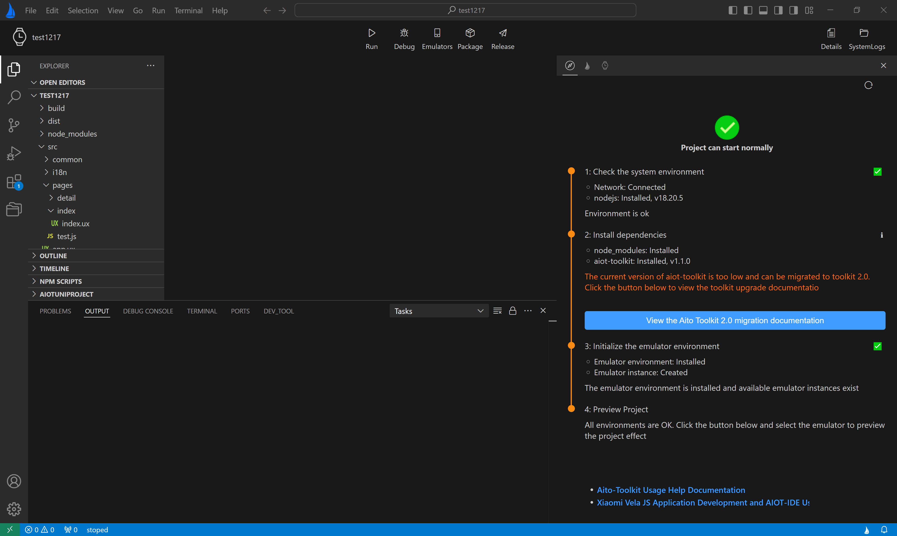

# AIoT-IDE Overview

\[ English | [简体中文](README_zh-cn.md) \]

`AIoT-IDE` is the official Integrated Development Environment (IDE) for developing `openvela JS` applications. Built on the foundation of [Visual Studio Code](https://code.visualstudio.com/), it inherits all of the features of VS Code, including code editing, plugin integration, theme customization, and personalized settings. Additionally, `AIoT-IDE` introduces a range of specialized enhancements for developing `openvela JS` applications, with key features as follows:

- Smart code suggestions
- `openvela JS` application debugging
- Real-time compilation and preview
- `openvela JS` application packaging and publishing

The interface is shown in the image below:

For more details, please refer to [Using the IDE to Develop JS Applications](https://iot.mi.com/vela/quickapp/zh/guide/start/use-ide.html).
