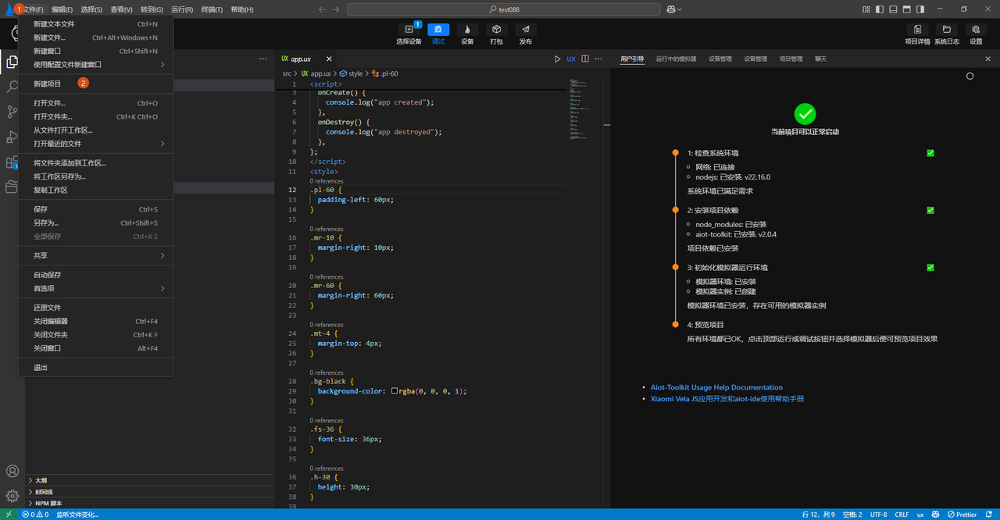
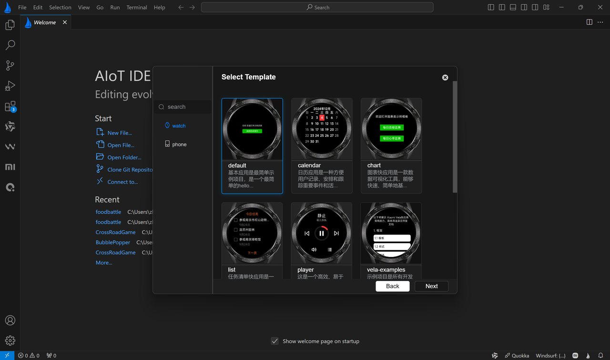
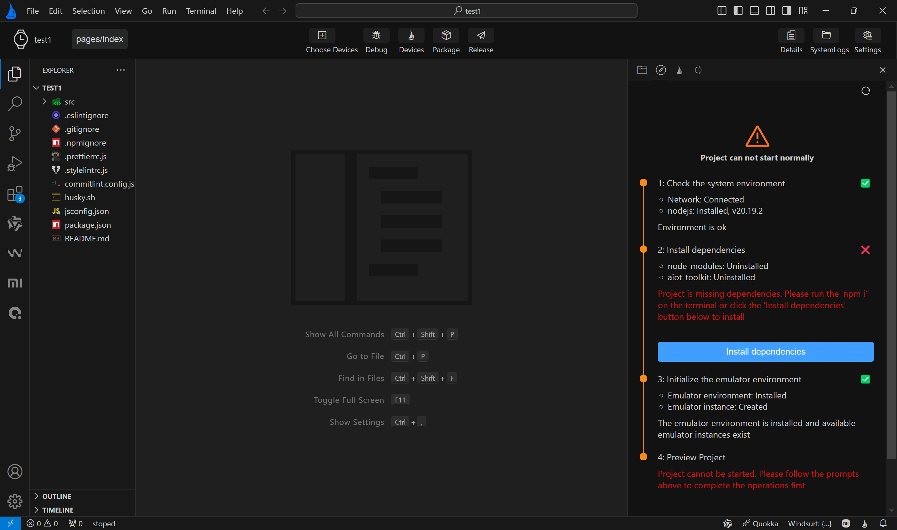
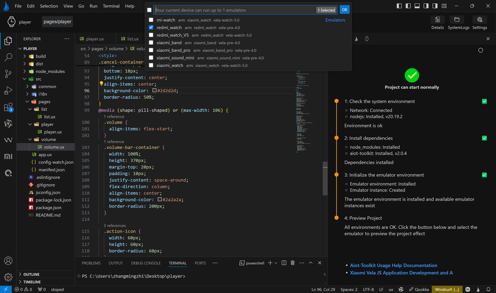
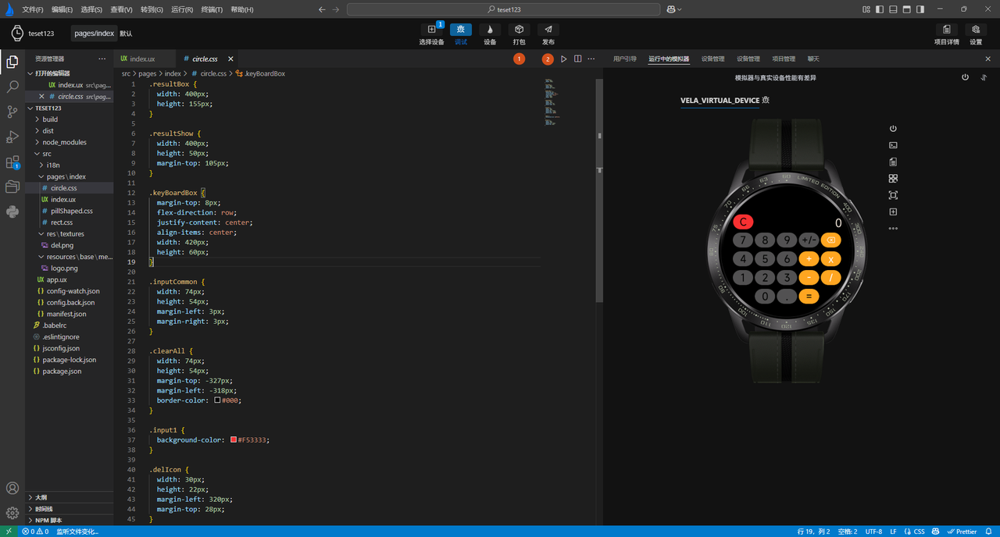

## 欢迎使用快应用-音乐播放器模板

本节以开源项目 Player 播放器为例，详细阐述在 openvela 系统中开发 JS 应用的全流程，涵盖环境配置、页面开发、音频接口调用及多屏适配。

## 一、环境配置与项目初始化

### 1、模拟器环境搭建

JS 应用使用配套编译器 AIoT-IDE 进行开发，AIoT-IDE 是用于开发 JS 应用的官方集成开发环境，提供了一系列专门针对于 JS 应用增强功能和专用模拟器。请参考官方文档[使用 AIoT-IDE 来开发 JS 应用](https://iot.mi.com/vela/quickapp/zh/guide/start/use-ide.html)完成安装。

### 2、创建项目

1. 打开 AIoT-IDE，选择 **New Project** 创建新项目：

    

2. 进入后选择 **Create Now**。

3. 在模板选择页面的 **Watch** 列表中，选择 **default** 默认模板：

    

4. 点击 **Next**，输入项目名称及路径，完成创建。

### 3、安装依赖

进入项目路径，按照 IDE 右侧指引安装相应环境，点击 **Install dependencies** 一键安装项目所需依赖库：



### 4、解析项目结构

JS 应用项目由配置文件（manifest.json）、模板代码（ux 文件）、 样式代码（css 文件）、逻辑代码（js 文件）以及资源文件（图片、音频等）组成。

典型的项目文件树状结构如下：

```Plain
your-project/
├── src/
│   ├── manifest.json       # 应用配置文件
│   ├── pages/              # 页面文件目录
│   │   ├── index           # 首页
│   │   └── ...             # 其他页面
│   ├── common/             # 资源文件（如图片、音频文件）
│   └── app.ux              # 入口文件
├── sign/                   # 签名文件目录（发布时生成）
├── build/                  # 构建输出目录
└── dist/                   # 打包输出目录（含 .rpk 文件）
```

## 二、开发流程详解

### 1、规划页面结构

在上述流程中，我们完成了模拟器开发环境的搭建，接下来便正式开始应用开发。

#### 页面组成

在开发过程中，主要涉及的文件包括：

- manifest.json：应用全局配置文件
- pages：页面文件
- common：资源文件

我们将要实现的 Player 播放器由三个核心页面：**播放器主页**、**音量调节页**和**歌曲列表页**。

在 pages 目录下分别创建三个文件夹：`list/list.ux`、`player/player.ux` 和 `volume/volume.ux`。

```Plain
pages/
├─list/
│   └─ list.ux      # 歌曲列表页
│
├─player/
│     └─player.ux   # 播放器主页
│
└─volume/
       └─volume.ux  # 音量调节页
```

#### 配置路由

在 manifest.json 中添加路由配置：

```JSON
  "router": {
    "entry": "pages/player",
    "pages": {
      "pages/player": { 
        "component": "player"
      },
      "pages/volume": {
        "component": "volume"
      },
      "pages/list": {
        "component": "list"
      }
    }
 }
```

#### 理解 UX 文件结构

JS 页面文件中使用 ux 模板来编辑，具体包含三个模块：

- template：页面布局结构
- script：逻辑交互
- style：页面样式

以下是一个 ux 模板的典型案例：

```HTML
<template>
  <div class="demo-page">
    <text class="title">{{ text }}</text>
  </div>
</template>

<script>
export default {
  private: {
    text: "欢迎打开详情页"
  }
}
</script>

<style>
.demo-page {
  flex-direction: column;
  justify-content: center;
  align-items: center;
}

.title {
  font-size: 20px;
  text-align: center;
}
</style>
```

### 2、静态页面布局与 UI 实现

按照上述 template、script、style 的结构分别完成三个页面的布局以及样式编写。

#### 播放器页面（Player）

根据总体布局，可将页面划分为三个部分：顶部歌曲信息、中部控制按钮组以及底部音量控制和歌单列表。

```HTML
<template>
  <div class="demo-page">
    <!-- 歌曲信息 -->
    <div class="song"></div>
    <!-- 播放控制按钮 -->
    <div class="controls"></div>
    <!-- 底部操作按钮 -->
    <div class="footer"></div>
  </div>
</template>

<style>
.demo-page {
  width: 100%;
  height: 100%;
  flex-direction: column;
  justify-content: center;
  align-items: center;
  background-color: #000;
}

.song {
  width: 320px;
  height: 160px;
  flex-direction: column;
  justify-content: center;
  align-items: center;
}

.controls {
  width: 360px;
  height: 160px;
  justify-content: space-between;
  align-items: center;
}

.footer {
  width: 320px;
  height: 160px;
  justify-content: space-around;
  align-items: center;
}
</style>
```

接下来按序填充各个部分：

- 头部歌曲信息，为了在歌曲播放时产生一些视觉效果，使用 marquee 跑马灯组件，该组件详细设置可参照[官方文档](https://iot.mi.com/vela/quickapp/zh/components/basic/marquee.html)，后续页面模板中涉及的特定组件将不再单独列出，可自行查阅官方文档。

    ```HTML
    <div class="song">
        <marquee class="song-name" scrollamount="{{36}}">Symphony No.5</marquee>
        <marquee class="singer-name" scrollamount="{{36}}">Beethoven</marquee>
    </div>
    ```

- 中部歌曲控制按钮，分为上一首、播放/暂停、下一首三部分：

    ```HTML
    <!-- 播放控制按钮 -->
    <div class="controls">
      <image class="icon" src="/common/icon/prev.png" />
      <div class="play-button">
        <!-- 播放进度条 -->
        <div class="progress-container">
          <progress class="play-progress" type="arc"></progress>
        </div>
        <image class="icon" src="/common/icon/pause.png" />
      </div>
      <image class="icon" src="/common/icon/next.png" />
    </div>
    ```

- 底部音量控制和歌曲列表按钮：

    ```HTML
    <!-- 底部操作按钮 -->
    <div class="footer">
        <image class="icon" src="/common/icon/volume.png" />
        <image class="icon" src="/common/icon/play-list.png" />
    </div>
    ```

完整 CSS 代码如下：

```HTML
<style>
.demo-page {
  width: 100%;
  height: 100%;
  flex-direction: column;
  justify-content: center;
  align-items: center;
  background-color: #000;
}

.progress-container {
  position: absolute;
  left: 0;
  top: 0;
  width: 200px;
  height: 200px;
  justify-content: center;
  align-items: center;
}

.play-button {
  width: 200px;
  height: 200px;
  justify-content: center;
  align-items: center;
}

.play-progress {
  radius: 74px;
  stroke-width: 14px;
  start-angle: 4deg;
  total-angle: 360deg;
  color: #ff3a3a;
  layer-color: rgba(255, 255, 255, 0.1);
}

.song {
  width: 320px;
  height: 160px;
  flex-direction: column;
  justify-content: center;
  align-items: center;
}

.song-name {
  width: 320px;
  font-size: 42px;
  color: #ffffff;
  lines: 1;
  text-overflow: ellipsis;
  text-align: center;
}

.singer-name {
  width: 300px;
  font-size: 26px;
  color: rgba(255, 255, 255, 0.8);
  lines: 1;
  text-overflow: ellipsis;
  text-align: center;
}

.controls {
  width: 360px;
  height: 160px;
  justify-content: space-between;
  align-items: center;
}

.icon {
  width: 64px;
  height: 64px;
}

.footer {
  width: 320px;
  height: 160px;
  justify-content: space-around;
  align-items: center;
}
</style>
```

#### 歌曲列表页面（List）

歌曲列表页由一个返回按钮以及歌曲列表组成，列表数据依赖于 songList 中的数据。

**Template** **结构：**

```HTML
<template>
  <div class="list-container">
    <text class="title">返回</text>
    <list class="list">
      <list-item class="item">
        <text class="item-index">1</text>
        <div class="detail">
          <text class="item-title">Symphony No.5</text>
          <text class="item-subtitle">Beethoven</text>
        </div>
      </list-item>
    </list>
  </div>
</template>
```

相应的 CSS 代码：

```CSS
<style>
.list-container {
  width: 100%;
  height: 100%;
  padding: 40px;
  flex-direction: column;
  align-items: center;
  background-color: black;
}

.title {
  font-size: 40px;
  text-align: center;
  color: #ff3a3a;
}

.list {
  width: 360px;
  margin-top: 10px;
  height: 300px;
}

.item {
  display: flex;
  width: 100%;
  height: 100px;
  padding-bottom: 8px;
}

.item-index {
  width: 60px;
  height: 100%;
  text-align: center;
  color: white;
}

.detail {
  flex: 1;
  height: 100%;
  flex-direction: column;
}

.item-title {
  width: 100%;
  font-size: 34px;
  height: 56px;
  line-height: 56px;
  color: #ffffff;
  lines: 1;
  text-overflow: ellipsis;
}

.item-subtitle {
  width: 100%;
  font-size: 28px;
  height: 44px;
  line-height: 44px;
  color: rgba(255, 255, 255, 0.6);
  lines: 1;
  text-overflow: ellipsis;
}
</style>
```

#### 音量设置页面（Volume）

音量设置页面中包含一个音量调节进度条和一个返回按钮。

**Template** **结构：**

```HTML
<template>
  <div class="volume">
    <!-- 控制音量按钮 -->
    <div class="volume-bar-container">
      <image class="action-icon" src="/common/icon/minus.png"></image>
      <div class="volume-progress-container">
        <progress class="volume-progress" percent="{{0}}"></progress>
      </div>
      <image class="action-icon" src="/common/icon/plus.png"></image>
    </div>
    <!-- 返回播放页面 -->
    <div class="cancel-container">
      <image class="action-icon" src="/common/icon/cancel.png"></image>
    </div>
  </div>
</template>
```

相应的 CSS 代码如下：

```CSS
<style>
.volume {
  width: 100%;
  height: 100%;
  justify-content: center;
  align-items: center;
  background-color: #000;
}

.volume-bar-container {
  width: 440px;
  height: 140px;
  justify-content: space-around;
  align-items: center;
  background-color: #2a2a2a;
  border-radius: 70px;
}
.volume-progress-container {
  width: 220px;
  height: 30px;
  justify-content: center;
  align-items: center;
}

.action-icon {
  width: 60px;
  height: 60px;
}

.volume-progress {
  color: #ff3a3a;
  stroke-width: 30px;
  layer-color: rgba(255, 255, 255, 0.1);
}

.cancel-container {
  position: absolute;
  width: 100px;
  height: 100px;
  bottom: 18px;
  justify-content: center;
  align-items: center;
  background-color: #2d2d2d;
  border-radius: 50%;
}
</style>
```

### 3、逻辑开发与事件处理

在上述流程中，我们完成了应用静态页面的开发，但页面与数据之间，页面与页面之间并没有建立起有效的联系，在这一步中我们将逐步完成应用的事件处理：

- 数据动态绑定
- 事件绑定
- 页面跳转

#### 数据动态绑定

在 JS 应用中，其架构模型同样使用 MVVM 模式完成，即展示的数据与页面脚本对象中的数据一一绑定，使得逻辑操作只需要关注脚本内的数据，而不需要显示直接操作 DOM。数据引用方式使用双大括号 `{{ }}` 完成，该方式不止用于标签内数据，同时可以应用于样式或类名。以下是一个典型案例：

```HTML
<template>
  <text>{{message}}</text>
</template>

<script>
  export default {
    // 页面级组件的数据模型，影响传入数据的覆盖机制：private内定义的属性不允许被覆盖
    private: {
      message: 'Hello'
    }
  }
</script>
```

#### 事件绑定

JS 的事件绑定有两种写法，以点击动作为例，分别为 onclick 和 @click，随后在 script 中注册相应事件即可完成数据绑定。以下是一个参考样例：

```HTML
<template>
  <div>
    <!-- 正常格式 -->
    <text onclick="press"></text>
    <!-- 缩写 -->
    <text @click="press"></text>
  </div>
</template>

<script>
  export default {
    press(e) {
      this.title = 'Hello'
    }
  }
</script>
```

#### 页面跳转 

完成页面内部逻辑后则需要进行页面间的跳转设置，页面跳转需要使用到 `@system.router` 模块，使用前请先在`manifest.json`中声明：

```JSON
{
  // ...
  "features": [
    { "name": "system.router" }
  ]
}
```

声明模块后，在 script 脚本中引入相应模块，并注册事件以触发跳转：

```XML
<script>
  import router from '@system.router'

  export default {
    // ...
    toListPage(eve) {
      if (eve.direction === 'up') {
        router.push({
          uri: '/pages/list'
        })
      }
    }
  }
</script>
```

#### 在 Player 播放器中实现事件处理

在我们的播放器应用中添加相应的交互事件。Player 播放器主页文件如下：

```HTML
<template>
  <div class="demo-page">
    <!-- 歌曲信息 -->
    <div class="song">
      <marquee class="song-name" scrollamount="{{36}}">
        {{ currSong.name || "未知" }}
      </marquee>
      <marquee class="singer-name" scrollamount="{{36}}">
        {{ currSong.artists || "未知" }}
      </marquee>
    </div>
    <!-- 播放控制按钮 -->
    <div class="controls">
      <image class="icon" src="/common/icon/prev.png" onclick="change(-1)" />
      <div class="play-button">
        <!-- 播放进度条 -->
        <div class="progress-container">
          <progress class="play-progress" type="arc" percent="{{progress}}"></progress>
        </div>
        <image class="icon" if="{{isPlaying}}" src="/common/icon/pause.png" onclick="playOrPause" />
        <image class="icon" else src="/common/icon/play.png" onclick="playOrPause" />
      </div>
      <image class="icon" src="/common/icon/next.png" onclick="change(1)" />
    </div>
    <!-- 底部操作按钮 -->
    <div class="footer">
      <image class="icon" src="/common/icon/volume.png" onclick="goToVolume" />
      <image class="icon" src="/common/icon/play-list.png" onclick="goToList" />
    </div>
  </div>
</template>
```

脚本部分，主要用于添加数据以及处理歌曲切换和页面跳转：

```JavaScript
<script>
import router from "@system.router";

export default {
  data: {
    // 当前歌曲索引
    index: 0,
    // 当前播放的歌曲信息
    currSong: null,
    // 需要播放的歌曲列表（以下为示例数据，实际项目中请替换为真实音频资源地址）
    songList: [
      {
        id: 1,
        name: "Symphony No.5",
        artists: "Beethoven",
        playUrl: "https://example.com/music/symphony_no5.mp3"
      },
      {
        id: 2,
        name: "Canon in D",
        artists: "Pachelbel",
        playUrl: "https://example.com/music/canon_in_d.mp3"
      },

      {
        id: 3,
        name: "Little Star",
        artists: "Mozart",
        playUrl: "https://example.com/music/little_star.mp3"
      }
    ],
    // 是否在播放
    isPlaying: false,
    // 当前播放进度
    progress: 0
  },
 
  change(dir) {
    this.index = (this.index + dir + this.songList.length) % this.songList.length;
    this.currSong = this.songList[this.index];
    this.playCurrsong();
  },

  goToVolume() {
    router.push({
      uri: "/pages/volume"
    });
  },

  goToList() {
    router.push({
      uri: "/pages/list"
    });
  }
};
</script>
```

list 歌曲列表文件模板和脚本：

```HTML
<template>
  <div class="list-container">
    <text class="title" onclick="goBack">返回</text>
    <list class="list">
      <list-item for="{{(index, item) in songList}}" class="item" onclick="play(item)" tid="id" type="song">
        <text class="item-index">{{ index + 1 }}</text>
        <div class="detail">
          <text class="item-title">{{ item.name }}</text>
          <text class="item-subtitle">{{ item.artists }}</text>
        </div>
      </list-item>
    </list>
  </div>
</template>

<script>
import router from "@system.router";

export default {
  data: {
    // 以下为示例数据，实际项目中请替换为真实音频资源地址
    songList: [
      {
        id: 1,
        name: "Symphony No.5",
        artists: "Beethoven",
        playUrl: "https://example.com/music/symphony_no5.mp3",
      },
      {
        id: 2,
        name: "Canon in D",
        artists: "Pachelbel",
        playUrl: "https://example.com/music/canon_in_d.mp3",
      },
      {
        id: 3,
        name: "Little Star",
        artists: "Mozart",
        playUrl: "https://example.com/music/little_star.mp3",
      },
    ],
  },

  play(item) {
    router.replace({
      uri: "/pages/player",
      params: {
        songId: item.id,
      },
    });
  },

  goBack() {
    router.back();
  },
};
</script>
```

volume 音量控制文件模板和脚本：

```HTML
<template>
  <div class="volume">
    <!-- 控制音量按钮 -->
    <div class="volume-bar-container">
      <image class="action-icon" src="/common/icon/minus.png" onclick="changeVolume(-1)"></image>
      <div class="volume-progress-container">
        <progress class="volume-progress" percent="{{volume}}"></progress>
      </div>
      <image class="action-icon" src="/common/icon/plus.png" onclick="changeVolume(1)"></image>
    </div>
    <!-- 返回播放页面 -->
    <div class="cancel-container">
      <image class="action-icon" src="/common/icon/cancel.png" onclick="goBack"></image>
    </div>
  </div>
</template>

<script>
import router from "@system.router";

export default {
  data: {
    volume: 0,
  },

  goBack() {
    router.back();
  },
};
</script>
```

### 4、音频模块调用

在上面几个章节中，我们实现了 Player 播放器的基本 UI 以及简单的交互逻辑，剩下的就是调取三方音频 API 接口进行歌曲播放了。以下是一些音频 API 内置的常见方法：

- audio.play()：开始播放音频。
- audio.pause()：暂停播放音频。
- audio.stop()：停止播放音频，可使用 play 重新播放。
- audio.end()：播放结束时的回调事件。
- audio.error()：播放发生错误时的回调事件。

查询更多 api 使用信息参见[官方文档](https://iot.mi.com/vela/quickapp/zh/features/other/audio.html#audio-play)。

首先在 manifest.json 配置文件中引入 audio feature：

```JSON
  "features": [
    ...
    {
      "name": "system.audio"
    }
  ],
```

然后在需要操作音频的文件中引入 feature 并注册相应事件。

player.ux：

```JavaScript
<script>
import router from "@system.router";
import audio from "@system.audio";

export default {
  onInit() {
    this.currSong = this.songList[this.index];
    // 音频开始播放事件
    audio.onplay = () => {
      this.isPlaying = true;
    };
    // 音频暂停播放事件
    audio.onpause = () => {
      this.isPlaying = false;
    };
    // 音频停止播放事件
    audio.onstop = () => {
      this.isPlaying = false;
    };
    // 音频播放随时间更新事件
    audio.ontimeupdate = () => {
      this.progress = audio.percent;
    };
    // 音频播放结束事件
    audio.onended = () => {
      this.change(1);
    };
  },

  onReady() {
    if (this.songId) {
      this.index = this.songList.findIndex((item) => item.id === this.songId);
      this.currSong = this.songList[this.index];
    }
    setTimeout(this.playCurrsong, 1000);
  },

  playCurrsong() {
    audio.stop();
    audio.src = this.currSong.playUrl;
    audio.play();
  },

  playOrPause() {
    if (this.isPlaying) {
      audio.pause();
    } else {
      audio.play();
    }
  },
  
  ...
  
  </script>
```

volume.ux

```JavaScript
<script>
import router from "@system.router";
import audio from "@system.audio";

export default {
  data: {
    volume: 0,
  },

  onInit() {
    this.volume = audio.volume * 100;
  },

  changeVolume(dir) {
    if (dir === -1) {
      if (this.volume < 10) {
        this.volume = 0;
      } else {
        this.volume -= 10;
      }
    } else {
      if (this.volume > 90) {
        this.volume = 100;
      } else {
        this.volume += 10;
      }
    }
    audio.volume = this.volume / 100;
  },

 ...

};
</script>
```

综上就完成了整个 Player 播放器应用的开发。

### 5、多屏适配

考虑到播放器可能不止运行在一套设备上，所以需要对播放器进行多屏适配，该章节主要涉及两块内容，分别是：

- 配置基准像素
- 使用媒体查询

#### 配置基准像素

基准像素也被称为“设计稿像素”，是需要在配置文件中显式定义的一种页面宽度基准，通过 `designWidth` 字段声明，其规则是：页面中的由 px 声明的样式会按照设备真实像素和 `designWidth` 字段配置的像素进行等比缩放。

公式为：实际像素 =  设备像素 / `designWidth` * 容器声明的像素

例如：如上示例中将 `designWidth` 配置为 336px，那么所有的 px 值使用都会按照 336px 的基准宽度换算。 假设设备屏幕实际宽度为 336 像素，则 `container` 元素的实际宽度也为 168 像素；如果设备屏幕实际宽度为 192 像素，则 container 元素的实际宽度为 96 像素。

`designWidth`中还有一个特殊字段声明，即 `"designWidth": "device-width"`，如果按照这个方式声明，则设备将按照设备像素决定实际像素，不会相应缩放。

在 player 播放器中我们使用的正是这种方式，在 manifest 中添加如下字段：

```JSON
  "config": {
    "logLevel": "log",
    "designWidth": "device-width"
  },
```

#### 使用媒体查询

媒体查询是根据不同设备编写样式的一套标准，通过媒体查询，可以在一套代码中单独设置不同分辨率设备的样式布局等，从而实现根据屏幕形状来应用不同的样式。

以下是 player 播放器应用中适配胶囊屏的媒体查询例子。

player 播放器主页：

```CSS
@media (max-width: 212) {
  .footer {
    width: 100%;
  }

  .controls {
    width: 100%;
  }

  .singer-name {
    width: 100%;
  }

  .progress-container {
    width: 100%;
  }

  .play-button {
    width: 100px;
  }

  .play-progress {
    radius: 46px;
  }

  .song {
    width: 100%;
  }

  .song-name {
    width: 100%;
  }

  .icon {
    width: 48px;
    height: 48px;
  }
}
```

list 歌曲列表页：

```CSS
@media (max-width: 212) {
  .list-container {
    padding: 10px;
  }
  .list {
    width: 100%;
    margin-top: 10px;
  }
  .title {
    font-size: 28px;
  }

  .item {
    display: flex;
    width: 100%;
    height: 100px;
    padding-bottom: 8px;
  }

  .item-index {
    width: 40px;
    height: 100%;
    text-align: center;
  }
  .item-title {
    font-size: 22px;
  }
  .item-subtitle {
    font-size: 20px;
  }
}
```

volume 音量控制页：

```CSS
@media (max-width: 212) {
  .volume {
    align-items: flex-start;
  }
  .volume-bar-container {
    width: 100%;
    height: 370px;
    margin-top: 20px;
    padding: 10px;
    justify-content: space-around;
    flex-direction: column;
    align-items: center;
    background-color: #2a2a2a;
    border-radius: 200px;
  }

  .action-icon {
    width: 60px;
    height: 60px;
    border-radius: 60px;
  }

  .volume-progress-container {
    width: 95%;
    height: 220px;
  }

  .volume-progress {
    color: #ff3a3a;
    stroke-width: 30px;
    layer-color: rgba(255, 255, 255, 0.1);
  }

  .cancel-container {
    position: absolute;
    width: 70px;
    height: 70px;
    justify-content: center;
    align-items: center;
    background-color: #2d2d2d;
    border-radius: 50%;
  }
}
```

## 三、运行、调试与发布

### 1、运行项目

点击 IDE 顶部第一个 **Choose Device** 按钮，选择运行设备：



### 2、调试项目

- 点击顶部第二个按钮 **Debug**，则 IDE 会自动启动第一步中选择的模拟器并运行项目。
- 与此同时，在底部终端选择 **DEV_TooL** 可以进入类似浏览器的调试页面。

### 3、打包和发布

JS 应用封装了专门的 **.rpk** 文件，使用 AIoT-IDE 内部指定的方式对项目进行打包和发布。

分别点击 IDE 顶部的 Package 和 Release 按钮，可以对应用进行打包和发布。



1. 点击 **Package** 打包按钮会在 dist 文件夹中生成 .debug.<版本号>.rpk 格式文件，该文件主要用于开发调试和定位错误。
2. 点击 **Release** 发布按钮则会生成对应的 .release.<版本号>.rpk 格式文件，该文件可用于实际的生产环境，即可直接应用于真实设备。
3. 在发布 **Release** 包前，模拟器会检查当前目录下是否包含签名文件，如果没有会进入创建签名页面，按提示点击完成即可创建签名文件。

签名文件创建成功后，再次点击发布即可创建 release 包。